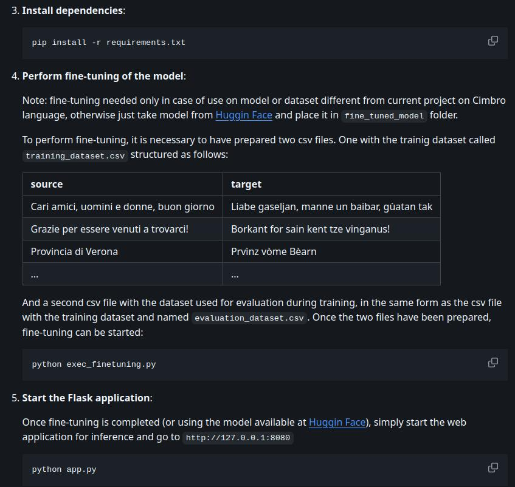
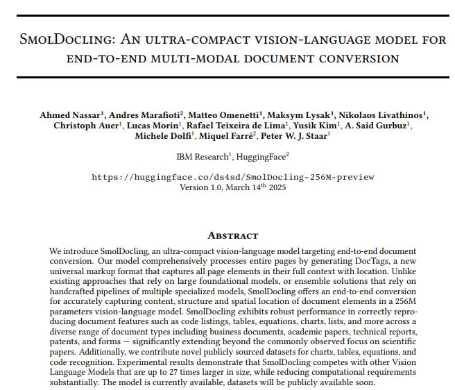

# VisionOCRSmolDocling: Image-Text-to-Text conversion with SmolDocling-256M
Traditional Optical Character Recognition (OCR) primarily focuses on extracting raw text from images. While useful, this often discards crucial structural information present in documents, such as headings, lists, tables, and reading order.

This project provides a simple Python class, `VisionOCRSmolDocling`, that leverages the power of the [SmolDocling-256M](https://huggingface.co/ds4sd/SmolDocling-256M-preview) model to perform multi-modal document conversion. Instead of just returning plain text, it processes document images and generates a text representation in the [DoclingDocument](https://docling-project.github.io/docling/concepts/docling_document/) format. This format aims to capture not just the text content but also elements of the document's layout and structure, making it more valuable for downstream tasks like document analysis, information extraction, or accessibility.
See the paper [SmolDocling: An ultra-compact vision-language model for end-to-end multi-modal document conversion](https://arxiv.org/pdf/2503.11576) for details of the work done.

## Installation

1. **Clone the repository**:

    ```bash
    git clone https://github.com/SigfridoCorradi/VisionOCRSmolDocling
    cd VisionOCRSmolDocling
    ```

2. **Create a virtual environment** (optional but **strongly** recommended):

    ```bash
    python -m venv venv
    source venv/bin/activate
    ```

3. **Install dependencies**:

    ```bash
    pip3 install -r requirements.txt
    ```

4.  **Model Download:** The SmolDocling model (`ds4sd/SmolDocling-256M-preview`) will be automatically downloaded to the `./smoldocling_local_model` directory the *first time* you instantiate the `VisionOCRSmolDocling` class. Ensure you have sufficient disk space (the model files are approximately 500MB).

## Usage

Here's how to use the `VisionOCRSmolDocling` class to extract text in Docling format from an image:

1.  **Prepare your image:** Have a document image file ready (e.g., `test.jpg`).

2.  **Run the script:** You can use the provided `__main__` block as an example:

    ```bash
    python VisionOCRSmolDocling.py
    ```

    This will instantiate the extractor, process `test.jpg`, and print the resulting Docling text.

3.  **Integrate into your Python code:**

    ```python
    from VisionOCRSmolDocling import VisionOCRSmolDocling
    import os

    # Path to your document image
    image_file_path = "path/to/your/image.jpg" # Replace with your image path

    if not os.path.exists(image_file_path):
        print(f"Error: Image file not found at {image_file_path}")
    else:
        try:
            # Initialize the extractor
            # (Model will be downloaded on first run)
            print("Initializing SmolDocling extractor...")
            extractor = VisionOCRSmolDocling(
                # Optional parameters:
                # device="cuda" if torch.cuda.is_available() else "cpu",
                # torch_dtype=torch.bfloat16, # Use bfloat16 for better performance on compatible GPUs
                # attention_implementation="eager" # Or "flash_attention_2" if installed
            )
            print("Extractor initialized.")

            # Extract text in Docling format
            print(f"Extracting Docling text from {image_file_path}...")
            extracted_docling = extractor.extract_text(
                image_path=image_file_path,
                prompt_text="Convert this page to docling." # Default prompt
                # max_new_tokens=4096 # Adjust max output length if needed
            )

            print("\n--- Extracted Docling Document ---")
            print(extracted_docling)
            print("----------------------------------")

        except Exception as e:
            print(f"An error occurred during processing: {e}")

    ```

## Output Format: DoclingDocument

The `extract_text` method returns a string containing the raw output from the SmolDocling model. This output is structured according to the **DoclingDocument** format.

The Docling format is a text-based representation designed to encode the content and layout of documents. It uses special tokens and indentation to represent elements like paragraphs, lists, tables, headings, etc., and their hierarchical relationships.

**This tool outputs the raw Docling text; it does not parse or interpret the Docling structure itself.** To work with the structured information, you would typically need a separate Docling parser.

## Code structure

The code is structured as class **VisionOCRSmolDocling**. Note the 2 class constants:

* DOCLING_MODEL_ID: valued by default with `ds4sd/SmolDocling-256M-preview` represents the model in question;
* DOCLING_LOCAL_DIR: valued by default with `./smoldocling_local_model` indicates the local path where to save the model, for offline use;

In the code we can see how the message is composed for the model:
```
messages = [
    {
        "role": "user",
        "content": [
            {"type": "image"},
            {"type": "text", "text": prompt_text}
        ]
    },
]
```

The class constructor as first downloads the model locally, if not already present, and then loads it into memory:
```
extractor = VisionOCRSmolDocling()
```

The `extract_text` method allows inference to be performed on the model:
```
extracted_text = extractor.extract_text(image_path=IMAGE_TO_TEST)
```
With the following arguments:
- `image_path` (str): Path to the input image.
- `prompt_text` (str): The required text to guide the extraction. The prompt may be different to more accurately extract specific content such as: `convert code to text`. Here the generic prompt `Convert this page to docling` is used.
- `max_new_tokens` (int): Maximum number of new tokens to generate (default 8192).

And the method returns the string of raw doctags, or an error message.

In the example given in `__main__` an extraction are performed for the image `test.jpg`.

## Examples

Source image:



Extracted text:

```
<doctag>
   <section_header_level_1>
      <loc_11>
      <loc_4>
      <loc_123>
      <loc_19>
      3. Install dependencies:
   </section_header_level_1>
   <text>
      <loc_32>
      <loc_40>
      <loc_180>
      <loc_54>
      pip install -r requirements.txt
   </text>
   <section_header_level_1>
      <loc_11>
      <loc_73>
      <loc_180>
      <loc_87>
      4. Perform fine-tuning of the model:
   </section_header_level_1>
   <text>
      <loc_22>
      <loc_97>
      <loc_492>
      <loc_125>
      Note: fine-tuning needed only in case of use on model or dataset different from current project on Cimbro language, otherwise just take model from Huggin Face and place it in fine_tuned_mode1 folder.
   </text>
   <text>
      <loc_22>
      <loc_137>
      <loc_481>
      <loc_165>
      To perform fine-tuning, it is necessary to have prepared two csv files. One with the training dataset called training_dataset.csv structured as follows:
   </text>
   <otsl>
      <loc_22>
      <loc_178>
      <loc_429>
      <loc_293>
        <ched>
        source
        <ched>
        target
      <nl>
        <fcel>
        Cari amici, uomini e donne, buon giorno
        <fcel>
        Liabe gaseljan, manne un baibar, gu'atan tak
      <nl>
        <fcel>
        Grazie per essere venuti a trovardi!
        <fcel>
        Borkant for sain kent tze vinganus!
      <nl>
        <fcel>
        Provincia di Verona
        <fcel>
        Prvinz v'ome B'earn
      <nl>
        <fcel>
        ...
        <fcel>
        ...
      <nl>
   </otsl>
   <text>
      <loc_22>
      <loc_304>
      <loc_486>
      <loc_346>
      And a second csv file with the dataset used for evaluation during training, in the same form as the csv file with the training dataset and named evaluation_dataset.csv . Once the two files have been prepared, fine-tuning can be started:
   </text>
   <text>
      <loc_22>
      <loc_366>
      <loc_153>
      <loc_379>
      python exec_finetuning.py
   </text>
   <section_header_level_1>
      <loc_11>
      <loc_400>
      <loc_148>
      <loc_414>
      5. Start the Flask application:
   </section_header_level_1>
   <text>
      <loc_22>
      <loc_424>
      <loc_453>
      <loc_453>
      Once fine-tuning is completed (or using the model available at Huggin Face), simply start the web application for inference and go to http://127.0.0.1:8080
   </text>
   <text>
      <loc_32>
      <loc_474>
      <loc_95>
      <loc_487>
      python app.py
   </text>
   <picture>
      <loc_470>
      <loc_364>
      <loc_486>
      <loc_380>
      <other>
   </picture>
</doctag>
<end_of_utterance>
```

Source image:



Extracted text:
```
<doctag>
   <text>
      <loc_21>
      <loc_44>
      <loc_492>
      <loc_86>
      SmolDocling: AN ULTRA-COMPACT VISION-LANGUAGE MODEL FOR END-TO-END MULTI-MODAL DOCUMENT CONVERSION
   </text>
   <text>
      <loc_44>
      <loc_142>
      <loc_471>
      <loc_180>
      Ahmed Nassar$^{1}$, Andres Marafioti$^{2}$, Matteo Omenetti$^{1}$, Maksym Lysak$^{1}$, Nikolaos Livathinos$^{1}$, Christopher Auer$^{1}$, Lucas Morin$^{1}$, Rafael Teixeira de Lima$^{1}$, Yusik Kim$^{1}$, A. Said Gurbuz$^{1}$, Michele Dolfi$^{1}$, Miquel Farre$^{2}$, Peter W. J. Staar 1
   </text>
   <text>
      <loc_196>
      <loc_195>
      <loc_314>
      <loc_207>
      IBM Research$^{1}$, HuggingFace$^{2}$
   </text>
   <text>
      <loc_100>
      <loc_221>
      <loc_411>
      <loc_247>
      https://huggingface.co/ds4sd/SmolDocling-256M-preview Version 1.0, March 14 th 2025
   </text>
   <section_header_level_1>
      <loc_225>
      <loc_295>
      <loc_284>
      <loc_307>
      ABSTRACT
   </section_header_level_1>
   <text>
      <loc_53>
      <loc_314>
      <loc_459>
      <loc_497>
      We introduce SmolDocling, an ultra-compact vision-language model targeting end-to-end document conversion. Our model comprehensively processes entire pages by generating DocTags, a new universal markup format that captures all page elements in their full context with location. Unlike existing approaches that rely on large foundational models, or ensemble solutions that rely on handcrafted pipelines of multiple specialized models, SmolDocling offers an end-to-end conversion for accurately capturing content, structure and spatial location of document elements in a 256M parameters vision-language model. SmolDocling exhibits robust performance in correctly reproducing document features such as code listings, tables, equations, charts, lists, and more across a diverse range of document types including business documents, academic papers, technical reports, patents, and forms - significantly extending beyond the commonly observed focus on scientific papers. Additionally, we contribute novel publicly sourced datasets for charts, tables, equations, and code recognition. Experimental results demonstrate that SmolDocling competes with other Vision Language Models that are up to 27 times larger in size, while reducing computational requirements substantially. The model is currently available, datasets will be publicly available soon.
   </text>
</doctag>
<end_of_utterance>
```


